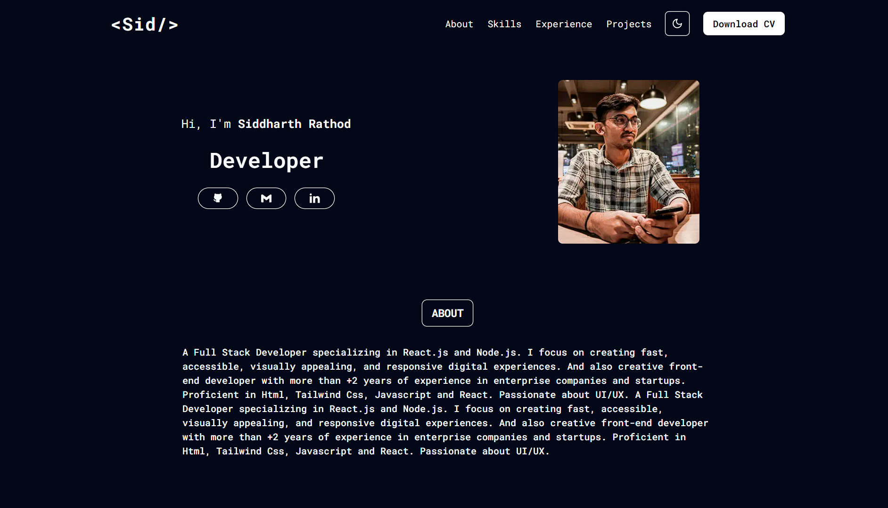

<p align="center">
</p>

---

<p align="center"> PortFolio by Siddharth Rathod
    <br> 
</p>

## 📝 Table of Contents

- [About](#about)
- [ScreenShot](#ss)
- [Getting Started](#getting_started)
- [Deployment](#deployment)
- [Built Using](#built_using)
- [Authors](#authors)

## 🧐 About <a name = "about"></a>

This is my personal portfolio website made by using NextJS.

- Live : https://portfolio-rsidd467.vercel.app

## 📷 Screenshot <a name = "ss"></a>



## 🏁 Getting Started <a name = "getting_started"></a>

These instructions will get you a copy of the project up and running on your local machine for development and testing purposes. See [deployment](#deployment) for notes on how to deploy the project on a live system.

### Prerequisites

Just clone this repository.

```
git clone This_Repo_URL
```

### Installing

Install dependencies:

```
npm i
```

Run development server:

```
npm run dev
```

## 🚀 Deployment <a name = "deployment"></a>

This project is deployed using [Vercel](https://vercel.com).

## ⛏️ Built Using <a name = "built_using"></a>

- [NextJs](https://nextjs.org/) - React Framework
- [Tailwind](https://tailwindcss.com/) - CSS Framework
- [Typescript](https://www.typescriptlang.org/) - Programming language
- [React](https://react.dev/) - Web library
- [NodeJs](https://nodejs.org/en/) - Server Environment

## ✍️ Authors <a name = "authors"></a>

- [@sidr467](https://github.com/sidr467) - Idea & Initial work
